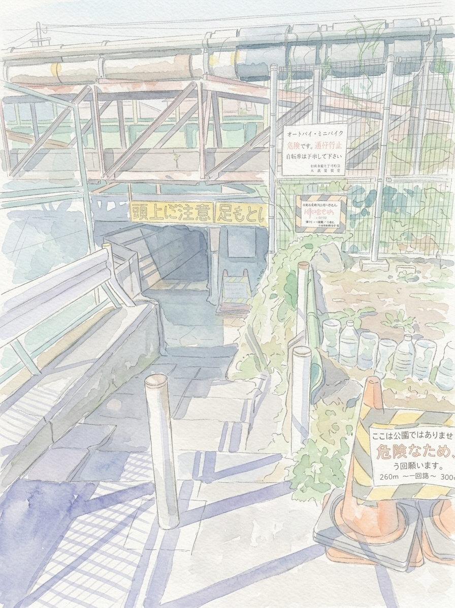

# 袋小路

    

## 流れ

* 袋小路（ブログ） <https://blog.bagend.info>
    
※ 各記事の要約は AI (Gemini) によって自動生成されています。

    <ul id="blog-entries-list">
        <li>記事を読み込み中...</li>
    </ul>
* BagEnd（tumblr） <https://tumblr.bagend.info>

## 翻訳モノ

* Eloquent JavaScript  <https://www.bagend.info/eloquentJavaScript/>
* HOWTO-Customize-LogWatch <https://www.bagend.info/howto-customize-logwatch/>
* Growl Doc(JP) ~~http://dl.dropbox.com/u/2198478/GrowlForWindows/index.html~~
* Pythonicって何？ <https://www.bagend.info/what-is-pythonic_jp/>
* 個体群動態：翻訳 <http://nmori.blog91.fc2.com/blog-entry-448.html>

## 保管庫

* [サービス停止] twitterおみくじ ~~https://omikuji.bagend.info~~
* [サービス停止] ニコニコ動画ランキングデータ ~~http://nicorank.bagend.info~~
* [サービス停止]コミックダッシュ・新刊カレンダー  ~~https://blog.bagend.info/2011/11/blog-post_19.html~~
* [サービス停止] 郵便番号検索 ~~https://www.bagend.info/zipcode.html~~

